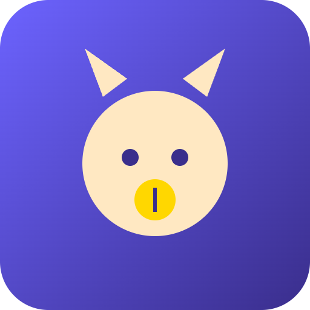

# PetYield


**Raise NFT pets that passively earn tokens through daily mini-games.**

## Overview
PetYield is a casual play-to-earn game built on Solana. Players mint an NFT pet that earns yield over time, boosted by completing short daily mini-games and quests. Pets level up, unlock new earning multipliers, and can be bred or traded, creating a low-effort play-to-earn loop with transparent on-chain logic.

## Problem
Hardcore play-to-earn games demand too much time investment, alienating casual players who want simple, low-commitment daily engagement with their crypto assets.

## Solution
A low-friction idle/casual game where a few minutes of daily play meaningfully boosts token earnings from an owned NFT pet, with all pet stats, earnings, and breeding logic running through Solana smart contracts.

## Features (MVP)
- Mint NFT pet with base yield rate stored on-chain
- Daily mini-game (tap/timing challenge) that boosts yield multiplier for 24h
- Claim accrued token rewards via on-chain program
- Pet leveling system unlocking cosmetic traits and higher base yield
- Breeding mechanic combining two pets into a new NFT with inherited traits

## Tech Stack
- Anchor (Solana smart contract framework)
- React Native (mobile client)
- Metaplex (NFT minting and metadata)
- Solana Pay (claim transactions)
- Switchboard (randomness for breeding traits)
- Node.js (backend services)

## How It Works

```
[Player] --mint--> [Anchor Program] --mints via--> [Metaplex NFT]
   |                      |
   |--play mini-game------|--updates yield multiplier (24h)
   |                      |
   |--claim rewards-------|--sends tokens via Solana Pay
   |                      |
   |--breed two pets------|--Switchboard randomness--> [New NFT]
```

The React Native app connects to an Anchor program on Solana, which stores each pet's stats, yield rate, and breeding logic on-chain. Daily mini-game results update a temporary yield multiplier. Claims trigger token transfers via Solana Pay, and breeding uses Switchboard randomness to determine inherited traits for the resulting NFT.

## Roadmap
- Add social features like pet showcase and leaderboards
- Introduce PvE pet battles for bonus yield
- Launch mobile app with push notifications for daily engagement

## Pitch
See our full pitch deck at [docs/pitch.pdf](docs/pitch.pdf) and the spoken pitch script at [docs/pitch-script.md](docs/pitch-script.md).

## Team
- [Name] - Role (placeholder)
- [Name] - Role (placeholder)
- [Name] - Role (placeholder)

Built for the Colosseum hackathon (Solana and other chains).

---

🎬 Pitch video: [docs/pitch-video.mp4](docs/pitch-video.mp4)


## Prototype

Live prototype: https://nakayamachamamk2.github.io/petyield/

The source is [docs/index.html](docs/index.html) (served with GitHub Pages from the /docs folder). All data is simulated.
